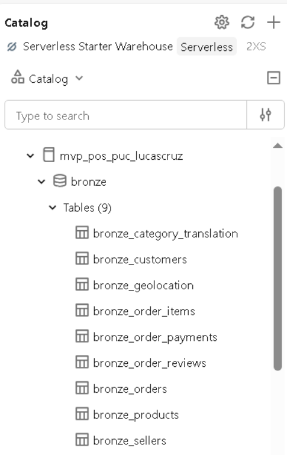
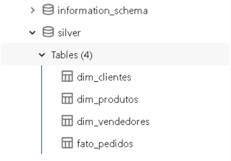
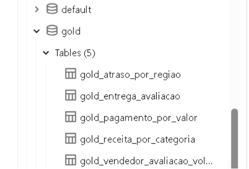
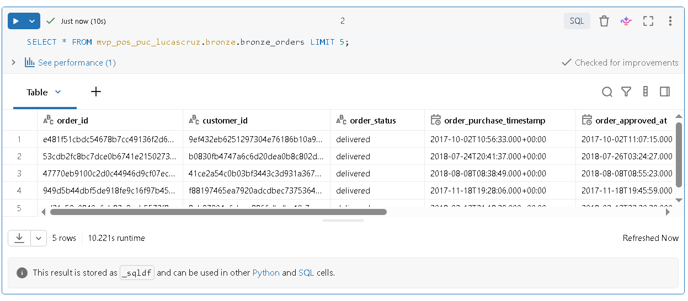
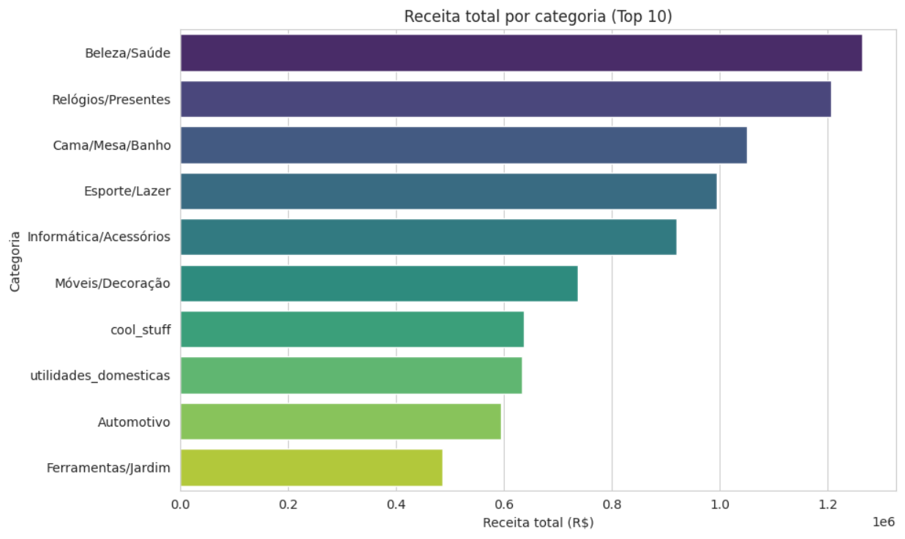
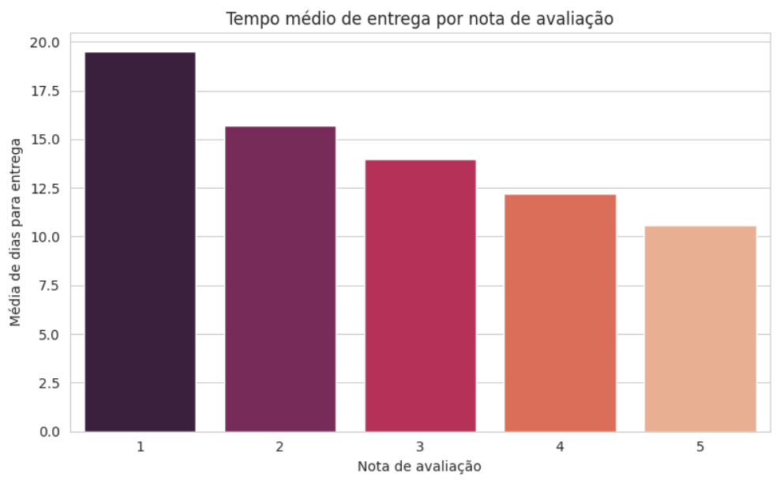
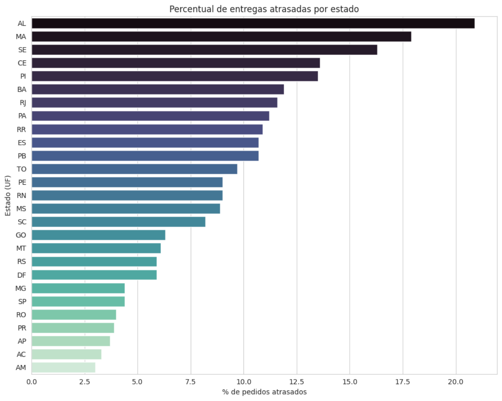
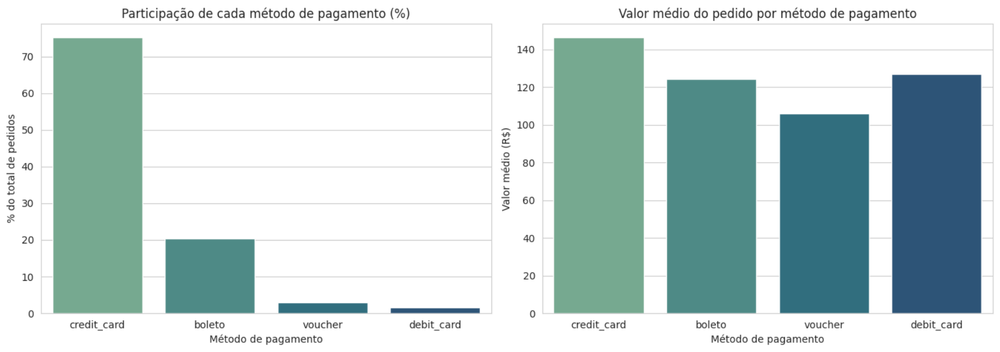
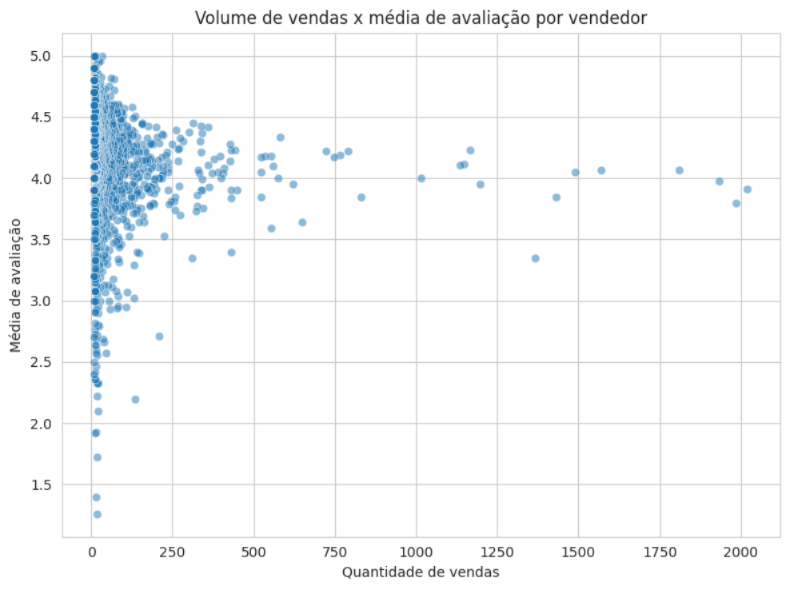

# MVP: Pipeline de Dados na Nuvem — E-commerce (Olist)

Trabalho final da pós-graduação em Data Science & Analytics — PUC-Rio.

**Autor:** Lucas Villar Magalhães da Cruz  
**Matrícula:** 4052025002504  
**Plataforma:** Databricks Free Edition  
**Dataset:** Brazilian E-Commerce Public Dataset by Olist (Kaggle)  

---

## Contexto de Negócio e Perguntas (Etapa 2 e 4.1)

**Objetivo:** Entender os fatores que influenciam a experiência de entrega e a satisfação do cliente no e-commerce, e como isso se relaciona com características do pedido, do vendedor e da região.

**Perguntas de negócio:**
1. Quais categorias de produto geram mais receita e qual o ticket médio por categoria?
2. O tempo de entrega influencia a nota de avaliação do cliente?
3. Existe relação entre a região/estado do cliente e o atraso na entrega?
4. Qual o método de pagamento mais usado e ele varia por valor do pedido?
5. Vendedores com mais avaliações positivas têm maior volume de vendas?

**Sobre os dados brutos:** Dataset público *Brazilian E-Commerce Public Dataset by Olist* (Kaggle), contendo ~100 mil pedidos reais de um marketplace brasileiro entre 2016-2018. Licenciado sob CC BY-NC-SA 4.0 (uso não comercial, com atribuição).

**Estrutura dos dados brutos (Bronze):**

| Tabela original (Olist) | Conteúdo | Principais colunas |
|---|---|---|
| `orders` | Um registro por pedido | order_id, customer_id, order_status, order_purchase_timestamp, order_estimated_delivery_date, order_delivered_customer_date |
| `order_items` | Um registro por item de pedido | order_id, order_item_id, product_id, seller_id, price, freight_value |
| `order_payments` | Pagamentos (pode haver mais de um por pedido) | order_id, payment_type, payment_installments, payment_value |
| `order_reviews` | Avaliação do cliente sobre o pedido | order_id, review_score, review_comment_message, review_creation_date |
| `customers` | Cadastro de clientes | customer_id, customer_city, customer_state, customer_zip_code_prefix |
| `sellers` | Cadastro de vendedores | seller_id, seller_city, seller_state, seller_zip_code_prefix |
| `products` | Cadastro de produtos | product_id, product_category_name, product_weight_g, dimensões |
| `product_category_name_translation` | Tradução de categoria (PT→EN) | product_category_name, product_category_name_english |
| `geolocation` | Coordenadas por CEP | geolocation_zip_code_prefix, lat, lng, city, state |

No total, são 9 arquivos CSV e cerca de 54 colunas. Todas as tabelas se conectam por chaves como `order_id`, `customer_id`, `product_id` e `seller_id`, formando a base para o modelo de Esquema Estrela construído nas camadas Silver/Gold. A tabela `geolocation` foi consultada, mas não incorporada ao modelo final, já que as perguntas de negócio foram respondidas com granularidade de estado — fica registrada como oportunidade em Trabalhos Futuros.

---

## Carga dos Dados (Etapa 4.2)

Os 9 arquivos CSV do dataset foram baixados do Kaggle e carregados manualmente, via upload direto na interface do Databricks, para tabelas na camada **Bronze** do catálogo `mvp_pos_puc_lucascruz` (schema `bronze`). Cada tabela foi mantida com os nomes de colunas originais (em inglês), preservando a fidelidade à fonte — princípio de rastreabilidade da Arquitetura Medalhão. A tradução para português foi aplicada apenas a partir da transformação Bronze → Silver, para não misturar o dado bruto com decisões de modelagem.

Tabelas criadas na Bronze: `bronze_orders`, `bronze_order_items`, `bronze_order_payments`, `bronze_order_reviews`, `bronze_customers`, `bronze_sellers`, `bronze_products`, `bronze_category_translation`, `bronze_geolocation`.

---

## Modelagem e Catálogo de Dados (Etapa 4.3)

O modelo segue um **Esquema Estrela**, com uma tabela fato central e três dimensões, construído na camada **Silver** do catálogo (notebook `01_bronze_para_silver.sql`).

**`fato_pedidos`** — grão: item de pedido

| Campo | Tipo | Descrição | Domínio |
|---|---|---|---|
| id_pedido | string | Identificador único do pedido | — |
| id_cliente | string | Chave para dim_clientes | — |
| id_vendedor | string | Chave para dim_vendedores | — |
| id_produto | string | Chave para dim_produtos | — |
| tipo_pagamento | string | Método de pagamento principal do pedido | cartão, boleto, voucher, débito |
| num_parcelas | int | Número de parcelas do pagamento | ≥ 1 |
| data_pedido | date | Data da compra | — |
| valor_item | decimal | Valor do item vendido | > 0 |
| valor_frete | decimal | Valor do frete | ≥ 0 |
| data_entrega_estimada | date | Prazo estimado de entrega | — |
| data_entrega_real | date | Data real de entrega (nulo se não entregue) | — |
| nota_avaliacao | int | Nota dada pelo cliente (nulo se não avaliado) | 1 a 5 |

**`dim_clientes`**: id_cliente (string), cidade (string), estado (string, sigla UF)

**`dim_vendedores`**: id_vendedor (string), cidade (string), estado (string, sigla UF)

**`dim_produtos`**: id_produto (string), categoria (string, traduzida do inglês via `bronze_category_translation`; `nao_informado` quando ausente na fonte)

Linhagem: todas as tabelas Silver derivam das tabelas Bronze correspondentes, via transformações documentadas no notebook `01_bronze_para_silver.sql`.

---

## Pipeline de Dados (Etapa 4.4)

O pipeline foi organizado em **dois notebooks SQL**, refletindo a progressão Bronze → Silver → Gold, mais um notebook Python para análise exploratória complementar:

- **`01_bronze_para_silver.sql`**: cria `fato_pedidos` (join entre `orders`, `order_items`, `order_payments` e `order_reviews`) e as três dimensões (`dim_clientes`, `dim_vendedores`, `dim_produtos`), com tradução dos nomes de colunas e tratamento de categorias ausentes.
- **`02_silver_para_gold.sql`**: cria 5 tabelas Gold, uma por pergunta de negócio (`gold_receita_por_categoria`, `gold_entrega_avaliacao`, `gold_atraso_por_regiao`, `gold_pagamento_por_valor`, `gold_vendedor_avaliacao_volume`), já agregadas e prontas para consumo.
- **`03_analise_exploratoria.py`**: carrega as tabelas Gold via Pandas e gera visualizações (Matplotlib/Seaborn) e correlações estatísticas para enriquecer a discussão de cada pergunta.

Cada transformação foi documentada em células de contexto (Markdown) antes da célula de código correspondente, explicando o que foi feito e por quê — incluindo decisões como o uso de `ROW_NUMBER()` para selecionar o pagamento principal em pedidos com múltiplos pagamentos.

Scripts disponíveis em [`/notebooks`](./notebooks) neste repositório.

---

## Qualidade de Dados (Etapa 4.5)

Verificação de completude, consistência, unicidade, acurácia e outliers, realizada na camada Silver antes de avançar para a Gold:

- **`fato_pedidos`**: sem nulos nas chaves (cliente, vendedor, produto) ou no valor do item. Nulos em `data_entrega_real` (2.475 registros, ~2,2%) e `nota_avaliacao` (942 registros, ~0,8%) são esperados — pedidos ainda não entregues/cancelados e clientes que não avaliaram. Sem valores negativos em preço/frete, nota dentro do domínio 1-5, e nenhuma entrega registrada antes da data do pedido.
- **Investigação de "duplicatas"**: a checagem inicial encontrou 7.642 combinações de `id_pedido` + `id_produto` com mais de uma ocorrência (até 20 repetições em um caso). A investigação, usando a coluna `order_item_id` da fonte bruta, confirmou que essas repetições representam múltiplas unidades do mesmo produto compradas no mesmo pedido — não duplicatas de carga. Nenhum tratamento foi necessário.
- **`dim_clientes`** e **`dim_vendedores`**: sem duplicatas de chave, sem nulos, quantidade de estados distintos consistente com as 27 UFs do Brasil.
- **`dim_produtos`**: 610 categorias nulas (~1,9%), confirmadas como ausentes já na tabela de origem (`bronze_products`) — tratadas substituindo o nulo por `'nao_informado'`.

---

## Análise de Dados (Etapa 4.5)

**1. Categorias e receita:** `health_beauty` lidera em receita total (R$ 1.263.138,54), mas `watches_gifts` tem o maior ticket médio (R$ 200,98) mesmo vendendo menos itens — indício de categoria mais premium. `bed_bath_table` tem o maior volume de itens vendidos, mas ticket médio mais baixo (R$ 93,25).

**2. Entrega e avaliação:** relação forte e inversa entre tempo de entrega e nota (correlação de **-0,98**): pedidos com nota 5 levam em média 10,6 dias para entrega, contra 19,5 dias nos pedidos com nota 1. O tempo de entrega parece ser um dos fatores mais determinantes da satisfação do cliente.

**3. Atraso por região:** os estados do **Nordeste** (AL, MA, SE, CE, PI, BA) concentram o maior percentual de atraso — resultado que contraria a hipótese inicial de que estados mais distantes geograficamente (Norte) seriam os mais afetados. Isso sugere uma cobertura logística mais fraca da Olist especificamente no Nordeste, e não uma relação simples com distância.

**4. Pagamento e valor:** cartão de crédito domina (75,2% dos pedidos), é o único método com parcelamento relevante (média de 3,7 parcelas) e tem o maior valor médio de pedido (R$ 146,46). Boleto, voucher e débito são majoritariamente à vista e com valores um pouco menores.

**5. Vendedor: volume x avaliação:** correlação praticamente nula (**-0,03**) entre quantidade de vendas de um vendedor e sua nota média — contrariando a expectativa de que mais vendas levariam a melhor (ou pior) reputação. A maior variação de notas em vendedores de baixo volume é efeito de variância amostral, não um padrão real.

**Discussão geral:** os resultados apontam a logística de entrega (tempo e região) como o fator mais associado à satisfação do cliente, mais do que características do vendedor. Isso sugere que investimentos em melhorar a previsibilidade e velocidade de entrega — especialmente no Nordeste — teriam maior impacto na experiência do cliente do que iniciativas focadas em reputação de vendedores.

---

## Autoavaliação

**Objetivos atingidos:** O pipeline completo foi construído de ponta a ponta, seguindo a Arquitetura Medalhão (Bronze → Silver → Gold), com 5 perguntas de negócio definidas no objetivo respondidas com evidência quantitativa (SQL e Python). Destaco duas descobertas que fugiram da hipótese inicial: (1) o atraso nas entregas se concentra proporcionalmente nos estados do Nordeste, e não no Norte como seria a hipótese mais intuitiva por distância geográfica; (2) não há correlação relevante entre volume de vendas de um vendedor e sua nota média de avaliação (-0,03), contrariando a expectativa de que quem vende mais tende a ter reputação melhor ou pior.

**Desafios:** Um ponto de atenção foi a tradução dos nomes de categoria de produto: a tabela de tradução do Olist mapeia do nome original em português para o inglês, e não o contrário, o que exigiu manter os dois nomes disponíveis (fazendo um JOIN adicional com a tabela bruta de tradução) para poder exibir rótulos bilíngues nos gráficos, além de lidar com uma categoria (`cool_stuff`) que nunca teve correspondente em português na fonte original. Por fim, a checagem de qualidade de dados identificou 7.642 combinações de pedido+produto com múltiplas ocorrências, que a princípio pareciam duplicatas; a investigação usando a coluna `order_item_id` da tabela bruta confirmou que se tratava de compras legítimas de múltiplas unidades do mesmo produto, reforçando a importância de investigar a causa de uma anomalia antes de tratá-la como erro.

**Trabalhos futuros:** Como próximos passos para enriquecer este MVP, seria possível: incorporar a tabela de geolocalização para análises espaciais mais precisas (mapas), aplicar um modelo preditivo de atraso de entrega usando as variáveis já modeladas, e criar um dashboard interativo (ex: Databricks Dashboards ou Power BI) consumindo diretamente as tabelas Gold.
